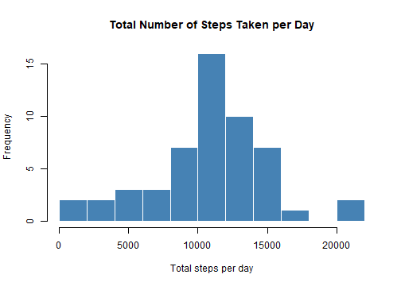
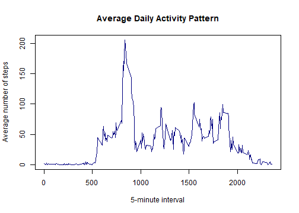
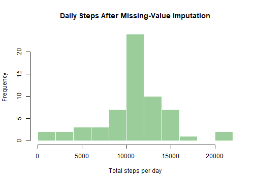
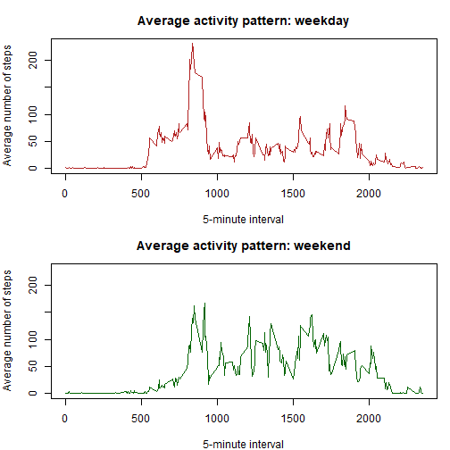

## Introduction

This report analyzes two months of measurements from a personal activity
monitoring device. The device recorded the number of steps taken in consecutive
five-minute intervals during October and November 2012.

## Loading and preprocessing the data

The data are read from `activity.csv`. If the CSV is not present after cloning
the repository, it is extracted automatically from `activity.zip`. Dates are converted from character values
to R's `Date` class. The original data are retained without modification in the
`activity` object.


``` r
if (!file.exists("activity.csv")) {
  unzip("activity.zip", files = "activity.csv")
}

activity <- read.csv(
  "activity.csv",
  header = TRUE,
  stringsAsFactors = FALSE,
  na.strings = "NA"
)

activity$date <- as.Date(activity$date, format = "%Y-%m-%d")

dim(activity)
```

```
## [1] 17568     3
```

``` r
str(activity)
```

```
## 'data.frame':	17568 obs. of  3 variables:
##  $ steps   : int  NA NA NA NA NA NA NA NA NA NA ...
##  $ date    : Date, format: "2012-10-01" "2012-10-01" ...
##  $ interval: int  0 5 10 15 20 25 30 35 40 45 ...
```

``` r
summary(activity)
```

```
##      steps             date               interval     
##  Min.   :  0.00   Min.   :2012-10-01   Min.   :   0.0  
##  1st Qu.:  0.00   1st Qu.:2012-10-16   1st Qu.: 588.8  
##  Median :  0.00   Median :2012-10-31   Median :1177.5  
##  Mean   : 37.38   Mean   :2012-10-31   Mean   :1177.5  
##  3rd Qu.: 12.00   3rd Qu.:2012-11-15   3rd Qu.:1766.2  
##  Max.   :806.00   Max.   :2012-11-30   Max.   :2355.0  
##  NAs    :2304
```

The dataset contains 17568 observations and 3
variables.

## What is the mean total number of steps taken per day?

Missing step measurements are ignored for this part. In this dataset, days with
missing measurements contain no observed step values, so those days do not
contribute to the following daily totals.


``` r
observed_activity <- activity[!is.na(activity$steps), ]

daily_steps <- aggregate(
  steps ~ date,
  data = observed_activity,
  FUN = sum
)

head(daily_steps)
```

```
##         date steps
## 1 2012-10-02   126
## 2 2012-10-03 11352
## 3 2012-10-04 12116
## 4 2012-10-05 13294
## 5 2012-10-06 15420
## 6 2012-10-07 11015
```

### Histogram of daily totals


``` r
hist(
  daily_steps$steps,
  breaks = 10,
  col = "steelblue",
  border = "white",
  main = "Total Number of Steps Taken per Day",
  xlab = "Total steps per day"
)
```



### Mean and median


``` r
mean_daily_steps <- mean(daily_steps$steps)
median_daily_steps <- median(daily_steps$steps)

mean_daily_steps
```

```
## [1] 10766.19
```

``` r
median_daily_steps
```

```
## [1] 10765
```

The mean total is **10766.19 steps per day**, and the
median is **10765 steps per day**.

## What is the average daily activity pattern?

For each five-minute interval, the following calculation averages the observed
step counts across all days.


``` r
interval_pattern <- aggregate(
  steps ~ interval,
  data = observed_activity,
  FUN = mean
)

plot(
  interval_pattern$interval,
  interval_pattern$steps,
  type = "l",
  lwd = 1.5,
  col = "navy",
  main = "Average Daily Activity Pattern",
  xlab = "5-minute interval",
  ylab = "Average number of steps"
)
```



The interval with the highest average is obtained directly from the summarized
data.


``` r
maximum_interval_row <- interval_pattern[
  which.max(interval_pattern$steps),
]

maximum_interval_row
```

```
##     interval    steps
## 104      835 206.1698
```

The **835** interval contains the maximum average
number of steps, with approximately **206.17**
steps.

## Imputing missing values

### Number of missing observations


``` r
missing_count <- sum(is.na(activity$steps))
missing_count
```

```
## [1] 2304
```

There are **2304** rows with missing step values.

### Imputation strategy

Each missing step value is replaced with the mean number of steps for the same
five-minute interval, calculated across all days with observed data. This
strategy preserves the overall daily activity pattern and supplies a value for
every missing observation.


``` r
interval_means <- aggregate(
  steps ~ interval,
  data = observed_activity,
  FUN = mean
)

imputed_activity <- activity
missing_rows <- is.na(imputed_activity$steps)

imputed_activity$steps[missing_rows] <- interval_means$steps[
  match(
    imputed_activity$interval[missing_rows],
    interval_means$interval
  )
]

sum(is.na(imputed_activity$steps))
```

```
## [1] 0
```

### Daily totals after imputation


``` r
imputed_daily_steps <- aggregate(
  steps ~ date,
  data = imputed_activity,
  FUN = sum
)

hist(
  imputed_daily_steps$steps,
  breaks = 10,
  col = "darkseagreen3",
  border = "white",
  main = "Daily Steps After Missing-Value Imputation",
  xlab = "Total steps per day"
)
```




``` r
imputed_mean <- mean(imputed_daily_steps$steps)
imputed_median <- median(imputed_daily_steps$steps)

imputed_mean
```

```
## [1] 10766.19
```

``` r
imputed_median
```

```
## [1] 10766.19
```

After imputation, the mean is **10766.19 steps per day** and
the median is **10766.19 steps per day**. The mean is
essentially unchanged because the replacement values come from the interval
means. The median moves closer to the mean, and the histogram gains observations
at the mean daily total because every completely missing day receives the same
average interval profile.

## Are there differences between weekdays and weekends?

A two-level factor identifies weekday and weekend observations. Numeric weekday
codes are used so the classification remains correct regardless of the computer's
language or locale.


``` r
day_number <- as.POSIXlt(imputed_activity$date)$wday

imputed_activity$day_type <- factor(
  ifelse(day_number %in% c(0, 6), "weekend", "weekday"),
  levels = c("weekday", "weekend")
)

table(imputed_activity$day_type)
```

```
## 
## weekday weekend 
##   12960    4608
```

The panel plot compares the average five-minute activity profiles.


``` r
day_type_pattern <- aggregate(
  steps ~ interval + day_type,
  data = imputed_activity,
  FUN = mean
)

old_par <- par(mfrow = c(2, 1), mar = c(4, 4, 3, 1))

for (current_type in levels(day_type_pattern$day_type)) {
  current_data <- day_type_pattern[
    day_type_pattern$day_type == current_type,
  ]

  plot(
    current_data$interval,
    current_data$steps,
    type = "l",
    lwd = 1.5,
    col = if (current_type == "weekday") "firebrick" else "darkgreen",
    main = paste("Average activity pattern:", current_type),
    xlab = "5-minute interval",
    ylab = "Average number of steps",
    ylim = range(day_type_pattern$steps)
  )
}
```



``` r
par(old_par)
```

Weekday activity has a sharper and higher morning peak, consistent with a more
regular early-day routine. Weekend activity is more broadly distributed through
the day and remains comparatively elevated during several later intervals.

## Conclusion

The participant averaged about 10766 observed steps per
day. Activity peaked during interval 835. Replacing
missing observations with interval-specific means left the mean daily total
unchanged but shifted the median toward the mean. Finally, weekday activity was
more concentrated in the morning, whereas weekend activity was spread more
evenly across the day.
